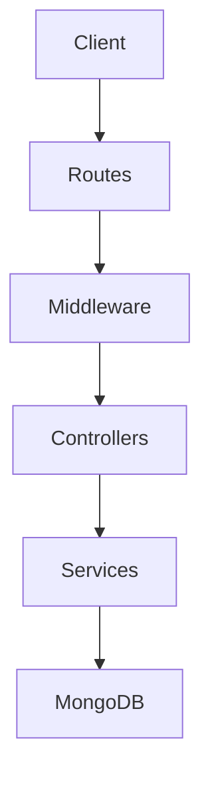
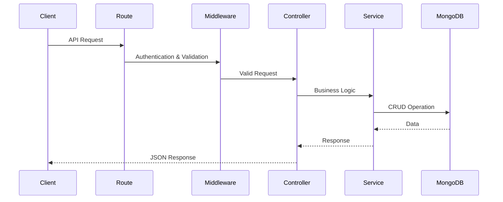

# 🎬 Movie Booking Application

> **A scalable RESTful backend for movie ticket booking built with Node.js, Express.js, MongoDB, and JWT Authentication.**

[](https://nodejs.org/)
[](https://expressjs.com/)
[](https://mongoosejs.com/)
[]()
[](LICENSE)

A production-ready backend API that powers an online movie ticket booking system. The application provides secure authentication, role-based authorization, theatre management, movie management, show scheduling, booking, and payment handling using a layered backend architecture.

---

# 🎞️ Demo Video
https://github.com/user-attachments/assets/8a40df5a-f3af-4a0b-9cdb-97e07a10f2e9

# 🌟 Overview

Movie Booking REST API is designed to simulate a real-world movie ticket booking platform.

The backend follows a layered architecture where requests travel through routes, middleware, controllers, services, and database models, making the project scalable and maintainable.

The API supports multiple user roles such as:

- Customer
- Theatre Owner
- Admin

Each role has different permissions and access levels.

---

# ✨ Key Features

## 🔐 Authentication & Authorization

- User Registration
- Secure Login
- JWT Authentication
- Password Hashing using bcrypt
- Role-Based Access Control
- Protected Routes

---

## 🎬 Movie Management

- Create Movies
- Update Movie Details
- Delete Movies
- Fetch All Movies
- Get Movie by ID

---

## 🏢 Theatre Management

- Register Theatre
- Update Theatre Information
- Delete Theatre
- View Theatre Details

---

## 🎟 Show Management

- Create Shows
- Update Shows
- Delete Shows
- Manage Show Timings
- Seat Availability

---

## 💳 Booking & Payment

- Book Tickets
- Generate Booking Records
- Payment APIs
- Booking History

---

## ⚡ Backend Features

- RESTful API Design
- MVC + Service Layer Architecture
- MongoDB Database
- Centralized Response Handling
- Middleware-based Validation
- Modular Folder Structure

---

# 🛠 Tech Stack

| Category | Technologies |
|-----------|--------------|
| Runtime | Node.js |
| Framework | Express.js |
| Database | MongoDB |
| ODM | Mongoose |
| Authentication | JWT |
| Password Encryption | bcrypt |
| Environment | dotenv |
| API Testing | Postman |
| Development | Nodemon |

---

# 🏗 Architecture

The application follows a layered architecture.



---

# 🔄 Request Lifecycle



---

# ⚙️ Working

## 1️⃣ Authentication

The user registers with:

- Name
- Email
- Password
- Role

Passwords are encrypted using bcrypt before storing them in MongoDB.

---

## 2️⃣ Login

After successful login,

- JWT Token is generated
- Token is returned to client
- Protected APIs require this token

---

## 3️⃣ Authorization

Middleware verifies:

- JWT Token
- User Role

Only authorized users can access restricted endpoints.

Example:

- Admin → Manage Movies
- Theatre Owner → Manage Theatre & Shows
- Customer → Book Tickets

---

## 4️⃣ Movie Management

Admins can

- Add Movies
- Update Movies
- Delete Movies

Customers can only view movie information.

---

## 5️⃣ Theatre & Show Management

Theatre owners can

- Register Theatre
- Create Shows
- Update Show Timings
- Manage Seats

---

## 6️⃣ Booking Flow

Customer

↓

Select Movie

↓

Select Theatre

↓

Choose Show

↓

Book Seats

↓

Payment

↓

Booking Confirmation

---

# 📁 Folder Structure

```text
Movie_Booking_API_Node
│
├── controllers/
│   ├── auth.controller.js
│   ├── booking.controller.js
│   ├── movie.controller.js
│   ├── payment.controller.js
│   ├── show.controller.js
│   ├── theatre.controller.js
│   └── user.controller.js
│
├── middlewares/
│   ├── auth.middlewares.js
│   ├── booking.middlewares.js
│   ├── movie.middlewares.js
│   ├── payment.middlewares.js
│   ├── show.middlewares.js
│   ├── theatre.middleware.js
│   └── user.middlewares.js
│
├── models/
│   ├── booking.model.js
│   ├── movie.model.js
│   ├── payment.model.js
│   ├── show.model.js
│   ├── theatre.model.js
│   └── user.model.js
│
├── routes/
│   ├── auth.routes.js
│   ├── booking.routes.js
│   ├── movie.routes.js
│   ├── payment.routes.js
│   ├── show.routes.js
│   ├── theatre.route.js
│   └── user.routes.js
│
├── services/
│   ├── booking.service.js
│   ├── movie.service.js
│   ├── payment.service.js
│   ├── show.service.js
│   ├── theatre.service.js
│   └── user.service.js
│
├── utils/
│   ├── constants.js
│   └── responsebody.js
│
├── index.js
├── package.json
└── README.md
```

---

# 📂 Folder Explanation

## 📁 Controllers

Receive requests from routes and coordinate business logic through services.

---

## 📁 Services

Contain all business logic and interact with MongoDB models.

---

## 📁 Models

Define MongoDB schemas using Mongoose.

Examples:

- User
- Movie
- Theatre
- Show
- Booking
- Payment

---

## 📁 Routes

Define all API endpoints.

Each resource has its own router.

---

## 📁 Middlewares

Responsible for

- Authentication
- Authorization
- Request Validation
- Access Control

---

## 📁 Utils

Contains reusable helper functions and standardized API response utilities.

---

# 🚀 Installation

## Clone Repository

```bash
git clone https://github.com/Aditya2584/Movie_Booking_API_Node.git
```

Move into project

```bash
cd Movie_Booking_API_Node
```

Install dependencies

```bash
npm install
```

Create a `.env` file

```env
PORT=5000
MONGO_URI=your_mongodb_connection
JWT_SECRET=your_secret_key
```

Start the server

```bash
npm start
```

Server runs on

```
http://localhost:5000
```

---

# 🔐 Environment Variables

| Variable | Description |
|-----------|-------------|
| PORT | Application Port |
| MONGO_URI | MongoDB Connection URL |
| JWT_SECRET | Secret key for JWT |

---

# 📡 API Modules

- Authentication APIs
- User APIs
- Movie APIs
- Theatre APIs
- Show APIs
- Booking APIs
- Payment APIs

---

# 🛡 Security

- JWT Authentication
- Password Encryption using bcrypt
- Protected Routes
- Role-Based Authorization
- Environment Variables using dotenv

---

# 📈 Future Improvements

- Seat Locking Mechanism
- Payment Gateway Integration (Stripe/Razorpay)
- Email Notifications
- Ticket QR Code Generation
- Movie Search & Filters
- Redis Caching
- Docker Deployment
- Swagger API Documentation
- Unit & Integration Testing
- CI/CD Pipeline

---

# 📸 Demo

Include:

- User Registration
- User Login
- JWT Authentication
- Movie CRUD
- Theatre CRUD
- Show CRUD
- Booking Tickets
- Payment API
- MongoDB Database Entries
- Postman API Testing

Ideal demo duration: **90–120 seconds**

---

# 🤝 Contributing

Contributions are welcome.

1. Fork the repository

2. Create a feature branch

```bash
git checkout -b feature/new-feature
```

3. Commit changes

```bash
git commit -m "Add new feature"
```

4. Push changes

```bash
git push origin feature/new-feature
```

5. Open a Pull Request

---

# 📄 License

This project is licensed under the MIT License.

---

# 👨‍💻 Author

**Aditya Kumar Singh**

GitHub: **https://github.com/Aditya2584**

If you found this project useful, don't forget to ⭐ the repository!
